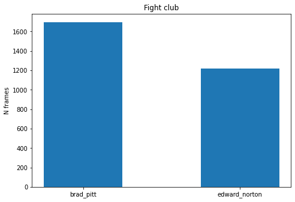

# face-detector-fight-club

Based on [Face recognition with OpenCV, Python, and deep learning Pyimagesearch's tutorial](https://www.pyimagesearch.com/2018/06/18/face-recognition-with-opencv-python-and-deep-learning/) is built this face recognition counter.

This facial recognition system detects the faces of **Brad Pitt** and **Edward Norton**, 
main characters on Fight Club movie. 

In each frame are detected the faces and is shown a real time bar plot. This was ran on a [clip of the movie](https://www.youtube.com/watch?v=CWRTqMGvdpc) and the output is [here](https://youtu.be/WEfk_Zbcqa0).

I ran this project on Google Colab with GPU. The video last 2:13 [m] and it took 3:41 [m] to get the output video. 
